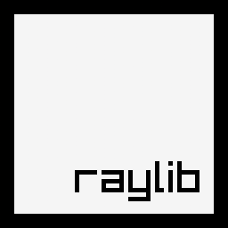

  

     
 

# raylib
### raylib for Pascal

Pascal bindings that allow you to use **raylib** and other useful libraries with <a href="https://www.embarcadero.com/es/products/delphi" target="_blank">Delphi</a> and <a href="https://www.freepascal.org" target="_blank">FreePascal</a>. 

### Included
- **raylib** (https://github.com/raysan5/raylib)
- **raygui** (https://github.com/raysan5/raygui)
- **physac** (https://github.com/raysan5/physac)
- **pl_mpeg** (https://github.com/phoboslab/pl_mpeg)

### Minimum Requirements 
- Should work on Windows 7+ (64 bits)
- Should work on any Delphi/FreePascal that can target Win64/Unicode

**NOTE: Made/tested on latest Windows/Delphi.**

### Usage
- You simply add `raylib` to your uses section and everything will be linked in your executable **(~700kb overhead)**, ready for use with no DLLs to maintain. You will have direct access to all the aforementioned libraries. :cool:  
- Load the `raylib For Pascal.groupproj` group file in `installdir\src\` folder into **Delphi** to compile/run examples.

*Visit the repo links for more information/documentation about the libraries used.* 

### Support
- <a href="https://github.com/tinyBigGAMES/raylib/issues" target="_blank">Issues</a>
- <a href="https://github.com/tinyBigGAMES/raylib/discussions/" target="_blank">Discussions</a>
- <a href="https://www.raylib.com/" target="_blank">raylib Homepage</a>
- <a href="https://github.com/raysan5/raylib/discussions/" target="_blank">raylib Forums</a>
- <a href="https://github.com/raysan5/raylib/wiki/" target="_blank">raylib Wiki</a>

 
   
 ♥ <b>Made for Pascal</b>

